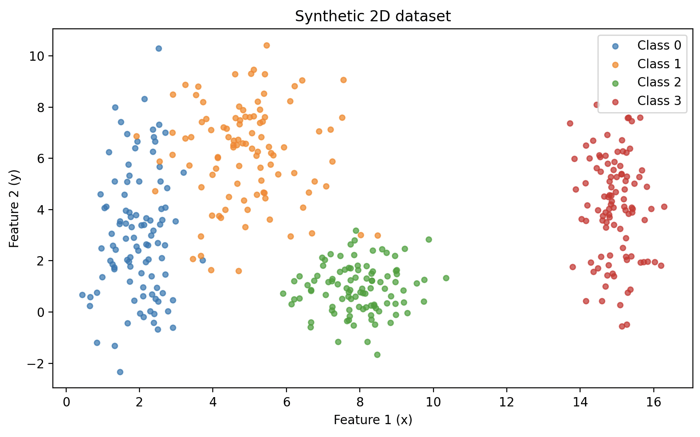
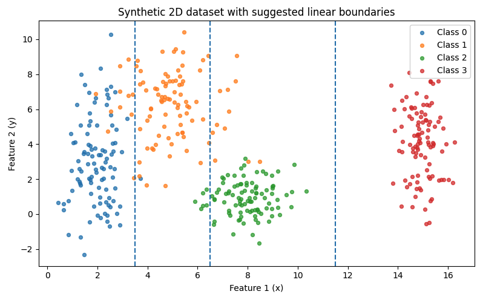
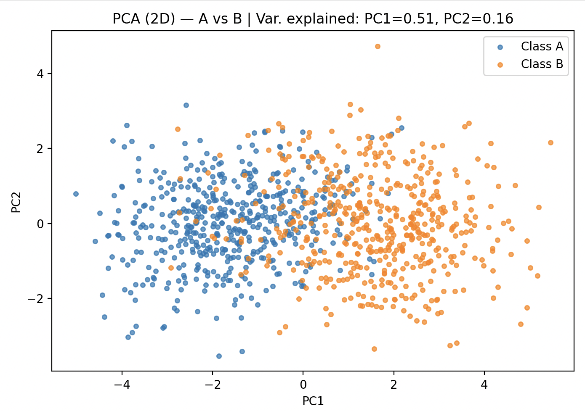
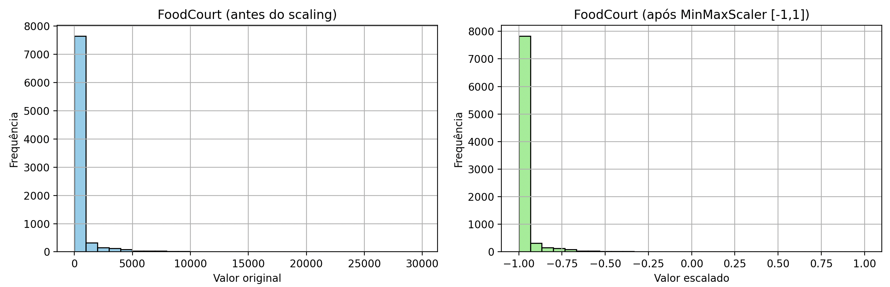
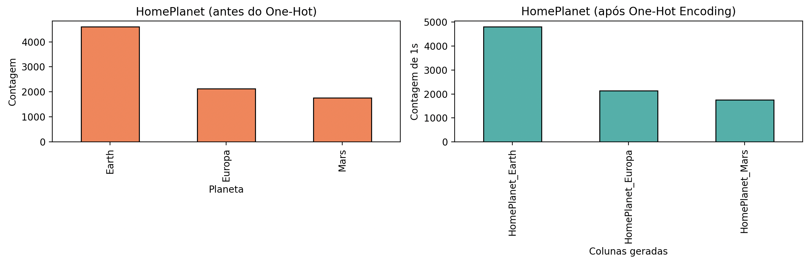

## Objetivo

Essa atividade foi elaborada para testar suas habilidades em gerar conjuntos de dados sintéticos, lidar com desafios de dados do mundo real e preparar dados para serem alimentados em redes neurais.

## Exercício 1

### Generate the Data

``` 
import numpy as np

SEED = 42
N_CLASSES = 4
N_PER_CLASS = 100

means = np.array([
    [2.0, 3.0],
    [5.0, 6.0],
    [8.0, 1.0],
    [15.0, 4.0],
])
stds = np.array([
    [0.8, 2.5],
    [1.2, 1.9],
    [0.9, 0.9],
    [0.5, 2.0],
])

def generate_data(means: np.ndarray, stds: np.ndarray, n_per_class: int, seed: int = 0):
    rng = np.random.default_rng(seed)
    X_list, y_list = [], []
    for c in range(len(means)):
        x = rng.normal(loc=means[c, 0], scale=stds[c, 0], size=n_per_class)
        y = rng.normal(loc=means[c, 1], scale=stds[c, 1], size=n_per_class)
        X_list.append(np.column_stack([x, y]))
        y_list.append(np.full(n_per_class, c, dtype=int))
    X = np.vstack(X_list)
    y = np.concatenate(y_list)
    return X, y

X, y = generate_data(means, stds, n_per_class=N_PER_CLASS, seed=SEED)

print(X, y)
```

### Plot the Data

```
import matplotlib.pyplot as plt

def plot_scatter_with_linear_cuts(X: np.ndarray, y: np.ndarray, means: np.ndarray, save_path: str | None = None):
    plt.figure(figsize=(8, 5))
    for c in np.unique(y):
        pts = X[y == c]
        plt.scatter(pts[:, 0], pts[:, 1], s=18, alpha=0.7, label=f"Class {c}")

    cuts = [
        (means[0, 0] + means[1, 0]) / 2.0,
        (means[1, 0] + means[2, 0]) / 2.0,
        (means[2, 0] + means[3, 0]) / 2.0,
    ]
    for cx in cuts:
        plt.axvline(cx, linestyle="--", linewidth=1.5)

    plt.title("Synthetic 2D dataset with suggested linear boundaries")
    plt.xlabel("Feature 1 (x)")
    plt.ylabel("Feature 2 (y)")
    plt.legend(loc="best")
    plt.tight_layout()
    if save_path:
        plt.savefig(save_path, dpi=200, bbox_inches="tight")
    plt.show()

plot_scatter_with_linear_cuts(X, y, means, save_path=None)
```


### Analyse and Draw Boundaries

**(a) Distribuição e sobreposição**

- **Classe 0 (μ ≈ [2,3])**: mais alongada no eixo *y* (σy = 2.5), formando uma “coluna” vertical à esquerda.  
- **Classe 1 (μ ≈ [5,6])**: variância moderada, localizada acima da Classe 2 em *y*, separada da Classe 0 em *x*.  
- **Classe 2 (μ ≈ [8,1])**: mais compacta e abaixo da Classe 1 em *y*.  
- **Classe 3 (μ ≈ [15,4])**: bem à direita, com σy = 2.0, praticamente sem mistura com as demais.  

**(b) Uma fronteira linear simples separa todas as classes?**

Sim. Um **conjunto de fronteiras lineares (retas verticais)** é suficiente para separar bem as quatro classes, pois os clusters estão ordenados principalmente ao longo do eixo *x*.  



**(c) Fronteiras sugeridas**

As fronteiras de decisão podem ser esboçadas como linhas verticais em:  

- **x ≈ 3.5** (entre Classe 0 e Classe 1)  
- **x ≈ 6.5** (entre Classe 1 e Classe 2)  
- **x ≈ 11.5** (entre Classe 2 e Classe 3)

## Exercício 2

### Generate the Data

```
import numpy as np

SEED = 42
rng = np.random.default_rng(SEED)

mu_A = np.zeros(5)
Sigma_A = np.array([
    [1.0, 0.8, 0.1, 0.0, 0.0],
    [0.8, 1.0, 0.3, 0.0, 0.0],
    [0.1, 0.3, 1.0, 0.5, 0.0],
    [0.0, 0.0, 0.5, 1.0, 0.2],
    [0.0, 0.0, 0.0, 0.2, 1.0],
])

mu_B = np.full(5, 1.5)
Sigma_B = np.array([
    [1.5, -0.7, 0.2, 0.0, 0.0],
    [-0.7, 1.5, 0.4, 0.0, 0.0],
    [0.2, 0.4, 1.5, 0.6, 0.0],
    [0.0, 0.0, 0.6, 1.5, 0.3],
    [0.0, 0.0, 0.0, 0.3, 1.5],
])

nA = 500
nB = 500

XA = rng.multivariate_normal(mu_A, Sigma_A, size=nA)
XB = rng.multivariate_normal(mu_B, Sigma_B, size=nB)
X = np.vstack([XA, XB])
y = np.array([0]*nA + [1]*nB)

print(X.shape, y.shape)
```

### Apply PCA and Plot the Data

```
import matplotlib.pyplot as plt
from sklearn.decomposition import PCA

pca = PCA(n_components=2, random_state=SEED)
X2 = pca.fit_transform(X)
evr = pca.explained_variance_ratio_

plt.figure(figsize=(7,5))
plt.scatter(X2[y==0,0], X2[y==0,1], s=14, alpha=0.7, label="Class A")
plt.scatter(X2[y==1,0], X2[y==1,1], s=14, alpha=0.7, label="Class B")
plt.xlabel("PC1")
plt.ylabel("PC2")
plt.title(f"PCA (2D) — A vs B | Var. explained: PC1={evr[0]:.2f}, PC2={evr[1]:.2f}")
plt.legend()
plt.tight_layout()
plt.show()
```



### Analyse the Plots

**(a) Relação entre as classes na projeção 2D**

- As classes aparecem **deslocadas ao longo de PC1** (efeito do vetor de médias).  
- Há **sobreposição visível** no centro: regiões em que pontos das duas classes se misturam.  
- As covariâncias diferentes dão orientações e alongamentos distintos aos clusters.  

**(b) Linear separability**

- Um corte linear em PC1 poderia reduzir parte do erro, mas **não separa perfeitamente** A e B.  
- A estrutura é **não linear**, devido à sobreposição e curvatura nas combinações de variáveis originais (5D).  
- **Modelos lineares simples** (perceptron, regressão logística) terão dificuldade.  

**(c) Por que usar redes neurais**

- Redes neurais com ativações não lineares (ReLU, tanh, sigmoid) podem aprender **fronteiras curvas** adaptando-se às orientações internas dos clusters.  
- Assim, conseguem classificar melhor quando os dados não são linearmente separáveis.

## Exercício 3

### Describe the Data

Objective:
- O Spaceship Titanic é um dataset de classificação binária. Coluna alvo (Transported) indica se o passageiro foi transportado para outra dimensão após o acidente da Spaceship Titanic.
    - True: passageiro transportado
    - False: passageiro não transportado
- O objetivo é prever Transported a partir dos dados dos passageiros.

Features:
- PassengerId: ID único de cada passageiro
- HomePlanet: planeta de origem do passageiro (categórica)
- CryoSleep: se o passageiro estava em sono criogênico (categórica)
- Cabin: número da cabine (categórica)
- Destination: destino da viagem (categórica)
- VIP: se o passageiro era VIP (categórica)
- Age: idade do passageiro (numérica)
- RoomService: gasto em serviço de quarto (numérica)
- FoodCourt: gasto no restaurante Food Court (numérica)
- ShoppingMall: gasto em compras (numérica)
- Spa: gasto em spa (numérica)
- VRDeck: gasto em simulador VR (numérica)
- Transported → variável alvo (target)

Missing Data:
```
import pandas as pd

df = pd.read_csv("docs/exercicio1/spaceship-titanic/train.csv")

missing_counts = df.isnull().sum()
missing = missing_counts[missing_counts > 0].sort_values(ascending=False)

print(f"Colunas com valores faltantes:\n{missing}")
```
Resultado:

Colunas com valores faltantes:
CryoSleep       217
ShoppingMall    208
VIP             203
HomePlanet      201
Name            200
Cabin           199
VRDeck          188
FoodCourt       183
Spa             183
Destination     182
RoomService     181
Age             179

### Proccess the Data
```
import pandas as pd
import numpy as np

from sklearn.compose import ColumnTransformer
from sklearn.pipeline import Pipeline
from sklearn.preprocessing import OneHotEncoder, MinMaxScaler
from sklearn.impute import SimpleImputer

def split_passenger_id(s):
    try:
        g, n = s.split("_")
        return int(g), int(n)
    except Exception:
        return np.nan, np.nan

def split_cabin(s):
    try:
        deck, num, side = s.split("/")
        num = pd.to_numeric(num, errors="coerce")
        return deck, num, side
    except Exception:
        return np.nan, np.nan, np.nan

df = pd.read_csv("docs/exercicio1/spaceship-titanic/train.csv")

df[["GroupId", "PassengerNum"]] = df["PassengerId"].apply(lambda s: pd.Series(split_passenger_id(s)))
df[["Deck", "CabinNum", "Side"]] = df["Cabin"].apply(lambda s: pd.Series(split_cabin(s)))

drop_cols = ["PassengerId", "Name", "Cabin"]
for c in drop_cols:
    if c in df.columns:
        df.drop(columns=c, inplace=True)

target_col = "Transported"
num_cols = [
    "Age", "RoomService", "FoodCourt", "ShoppingMall", "Spa", "VRDeck",
    "PassengerNum", "GroupId", "CabinNum"
]
cat_cols = [
    "HomePlanet", "CryoSleep", "Destination", "VIP", "Deck", "Side"
]

numeric_imputer = SimpleImputer(strategy="median")
categorical_imputer = SimpleImputer(strategy="most_frequent")

scaler = MinMaxScaler(feature_range=(-1, 1))
ohe = OneHotEncoder(handle_unknown="ignore", sparse_output=False)

numeric_pipeline = Pipeline(steps=[
    ("imputer", numeric_imputer),
    ("scaler", scaler),
])

categorical_pipeline = Pipeline(steps=[
    ("imputer", categorical_imputer),
    ("onehot", ohe),
])

pre = ColumnTransformer(
    transformers=[
        ("num", numeric_pipeline, num_cols),
        ("cat", categorical_pipeline, cat_cols),
    ],
    remainder="drop"
)

X = df.drop(columns=[target_col]) if target_col in df.columns else df.copy()
y = None
if target_col in df.columns:
    y = df[target_col].astype("int64")

X_proc = pre.fit_transform(X)

num_names = num_cols
cat_names = []
if len(cat_cols) > 0:
    ohe_feat_names = pre.named_transformers_["cat"].named_steps["onehot"].get_feature_names_out(cat_cols)
    cat_names = ohe_feat_names.tolist()
feature_names = num_names + cat_names

X_proc_df = pd.DataFrame(X_proc, columns=feature_names, index=X.index)
if y is not None:
    X_proc_df[target_col] = y.values

X_proc_df.to_csv("docs/exercicio1/spaceship-titanic/train_preprocessed.csv", index=False)
```

### FoodCourt & HomePlanet Histograms
```
import matplotlib.pyplot as plt

fig, axes = plt.subplots(1, 2, figsize=(12, 4))

df["FoodCourt"].hist(ax=axes[0], bins=30, color="skyblue", edgecolor="black")
axes[0].set_title("FoodCourt (antes do scaling)")
axes[0].set_xlabel("Valor original")
axes[0].set_ylabel("Frequência")

foodcourt_idx = feature_names.index("FoodCourt")
pd.Series(X_proc[:, foodcourt_idx]).hist(ax=axes[1], bins=30, color="lightgreen", edgecolor="black")
axes[1].set_title("FoodCourt (após MinMaxScaler [-1,1])")
axes[1].set_xlabel("Valor escalado")
axes[1].set_ylabel("Frequência")

plt.tight_layout()
plt.show()

fig, axes = plt.subplots(1, 2, figsize=(12, 4))

df["HomePlanet"].value_counts().plot(kind="bar", ax=axes[0], color="coral", edgecolor="black")
axes[0].set_title("HomePlanet (antes do One-Hot)")
axes[0].set_xlabel("Planeta")
axes[0].set_ylabel("Contagem")

homeplanet_cols = [c for c in feature_names if c.startswith("HomePlanet_")]
pd.DataFrame(X_proc, columns=feature_names)[homeplanet_cols].sum().plot(kind="bar", ax=axes[1], color="lightseagreen", edgecolor="black")
axes[1].set_title("HomePlanet (após One-Hot Encoding)")
axes[1].set_xlabel("Colunas geradas")
axes[1].set_ylabel("Contagem de 1s")

plt.tight_layout()
plt.show()
```




Escolhi mostrar o HomePlanet justamente porque o One-Hot não altera a distribuição original, apenas muda a representação. Isso mostra que em algumas variáveis o pré-processamento não traz diferença prática.