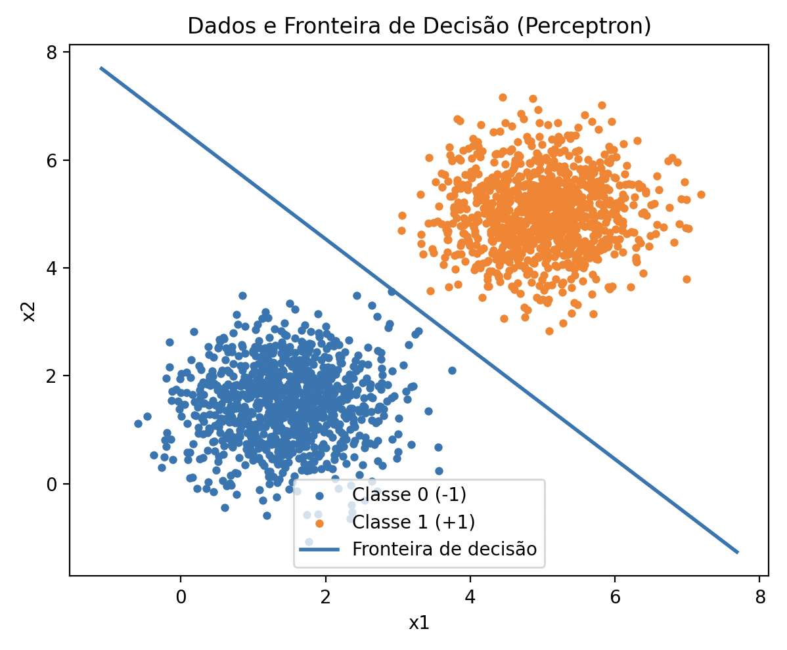
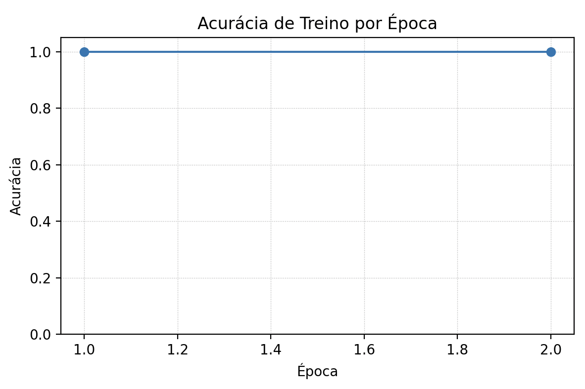
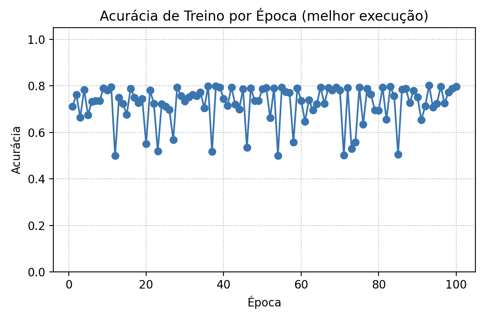

## Objetivo

O objetivo é implementar um perceptron e analisar seu desempenho em dados separáveis e não separáveis.

## Exercício 1

### Generate the Data

```
import numpy as np

rng = np.random.default_rng(42)

mean0 = np.array([1.5, 1.5])
cov0  = np.array([[0.5, 0.0],[0.0, 0.5]])

mean1 = np.array([5.0, 5.0])
cov1  = np.array([[0.5, 0.0],[0.0, 0.5]])

n = 1000
X0 = rng.multivariate_normal(mean0, cov0, size=n)
X1 = rng.multivariate_normal(mean1, cov1, size=n)

X = np.vstack([X0, X1])
y = np.hstack([-np.ones(n), np.ones(n)])

```

Esse código gera 2000 pontos em 2D:

- Classe 0 centrada em (1.5,1.5)
- Classe 1 centrada em (5,5)

Ambas com variância 0.5 em cada eixo e sem covariância.

### Implement the Perceptron
```
w = np.zeros(2)
b = 0.0
eta = 0.01
max_epochs = 100

def predict_scores(X, w, b):
    return X @ w + b

def predict_labels(X, w, b):
    return np.where(predict_scores(X, w, b) >= 0, 1, -1)

acc_history = []
for epoch in range(max_epochs):
    updates = 0
    for xi, yi in zip(X, y):
        if yi * (w @ xi + b) <= 0:
            w += eta * yi * xi
            b += eta * yi
            updates += 1
    y_hat = predict_labels(X, w, b)
    acc_history.append((y_hat == y).mean())
    if updates == 0:
        break

print("Pesos:", w, "Viés:", b, "Épocas:", len(acc_history), "Acc:", acc_history[-1])
```

### Plot the Results
```
import matplotlib.pyplot as plt

xs = np.linspace(X[:,0].min()-0.5, X[:,0].max()+0.5, 200)
ys = -(w[0]/w[1])*xs - b/w[1]

plt.figure(figsize=(6,5))
plt.scatter(X[y==-1][:,0], X[y==-1][:,1], s=12, label="Classe 0 (-1)")
plt.scatter(X[y== 1][:,0], X[y== 1][:,1], s=12, label="Classe 1 (+1)")
plt.plot(xs, ys, c="k", linewidth=2, label="Fronteira de decisão")
plt.title("Dados e Fronteira de Decisão (Perceptron)")
plt.xlabel("x1"); plt.ylabel("x2"); plt.legend()
plt.show()

plt.figure(figsize=(6,4))
plt.plot(np.arange(1, len(acc_history)+1), acc_history, marker="o")
plt.title("Acurácia de Treino por Época")
plt.xlabel("Época"); plt.ylabel("Acurácia")
plt.ylim(0,1.05); plt.grid(True, linestyle=":")
plt.show()
```





### Analyse and Results

- O perceptron partiu de pesos nulos e atualizou conforme os erros.
- Como as classes têm boa separação linear (centros distantes e baixa variância), o algoritmo convergiu muito rápido (em apenas 2 épocas).
- Pesos finais: ≈ [0.017, 0.0167]
- Viés: ≈ -0.11
- Acurácia final: 100% (sem erros de classificação).

A fronteira de decisão é aproximadamente uma reta com inclinação -1, que separa perfeitamente os dois clusters.

## Exercise 2

### Data Generation
```
import numpy as np

rng = np.random.default_rng(123)

mean0 = np.array([2.5, 2.5])
mean1 = np.array([4.0, 4.0])

cov0  = np.array([[1.5, 0.0],[0.0, 1.5]])
cov1  = np.array([[1.5, 0.0],[0.0, 1.5]])

n = 1000
X0 = rng.multivariate_normal(mean0, cov0, size=n)
X1 = rng.multivariate_normal(mean1, cov1, size=n)

X = np.vstack([X0, X1])
y = np.hstack([-np.ones(n), np.ones(n)])
```

Racional: As médias (2.5,2.5) e (4,4) são mais próximas e a variância maior (1.5) em cada dimensão cria forte sobreposição, tornando o dataset não linearmente separável.

### Perceptron Implementation
```
def train_perceptron(X, y, eta=0.01, max_epochs=100, rng=None):
    if rng is None: rng = np.random.default_rng()
    w = np.zeros(2); b = 0.0
    def predict(X_): return np.where(X_ @ w + b >= 0, 1, -1)

    acc_hist, upd_hist = [], []
    for _ in range(max_epochs):
        updates = 0
        idx = rng.permutation(len(X))
        X, y = X[idx], y[idx]
        for xi, yi in zip(X, y):
            if yi * (w @ xi + b) <= 0:
                w += eta * yi * xi
                b += eta * yi
                updates += 1
        acc_hist.append((predict(X) == y).mean())
        upd_hist.append(updates)
        if updates == 0: break
    return w, b, np.array(acc_hist), np.array(upd_hist)
```

Rodamos 5 execuções (embaralhamentos diferentes) e reportamos o melhor resultado e a média.

### Results
- Melhor acurácia final: 0.7970 (run com seed=1001)
- Acurácia média (5 runs): 0.7689
- Pesos finais (w): [0.0802, 0.0882]
- Viés (b): -0.50
- Épocas até parada: 100 (não houve convergência total, o algoritmo oscilou até o limite).

### Decision Boundary & Accuracy
```
xs = np.linspace(X[:,0].min()-0.8, X[:,0].max()+0.8, 300)
ys = -(w[0]/(w[1]+1e-12))*xs - b/(w[1]+1e-12)

plt.figure(figsize=(6,5))
plt.scatter(X[y==-1][:,0], X[y==-1][:,1], s=12, label="Class 0 (-1)")
plt.scatter(X[y== 1][:,0], X[y== 1][:,1], s=12, label="Class 1 (+1)")
plt.plot(xs, ys, linewidth=2, label="Decision boundary")
mis = np.where(np.where(X @ w + b >= 0, 1, -1) != y)[0]
plt.scatter(X[mis,0], X[mis,1], marker='x', s=35, label="Misclassified")
plt.title("Decision Boundary with Misclassified Points")
plt.xlabel("x1"); plt.ylabel("x2"); plt.legend(); plt.tight_layout()
plt.show()
```


```
plt.figure(figsize=(6,4))
plt.plot(np.arange(1, len(acc_history)+1), acc_history, marker="o")
plt.title("Training Accuracy per Epoch (best run)")
plt.xlabel("Epoch"); plt.ylabel("Accuracy")
plt.ylim(0,1.05); plt.grid(True, linestyle=":")
plt.show()
```



### Discussion
Comparação com Exercise 1: no exercício anterior, as classes eram bem separadas (médias distantes, variância baixa) e o perceptron convergiu em apenas 2 épocas, atingindo 100% de acurácia.

Neste exercício:
- Houve parcial sobreposição → o perceptron não convergiu em 100 épocas.
- Acurácia máxima ficou em torno de 80%, mesmo na melhor execução.
- Acurácia apresentou oscilações significativas entre épocas, refletindo a instabilidade dos dados não separáveis.
- Sempre existirão pontos mal classificados, visíveis no gráfico.

Conclusão: A presença de sobreposição limita a capacidade do perceptron linear em atingir separação perfeita, reforçando a necessidade de modelos mais expressivos (ex: múltiplas camadas, funções de ativação não lineares).