# Projeto 2 - Regression - Tomas Miele e Yuri Tabacof

## 1. Dataset Selection

**Nome do dataset:** S&P 500 Historical Data — Stock Market Index Prediction  
**Fonte:** Yahoo Finance / Kaggle  
**URL:** https://www.kaggle.com/datasets/whenamancodes/sp-500-stock-data  
**Tamanho:** ~15.000 registros diários, 7 variáveis (Open, High, Low, Close, Adj Close, Volume, Date)  

**Tarefa:** Regressão — prever o **preço de fechamento (Close)** do índice S&P 500 com base em variáveis históricas de mercado.  

**Justificativa da escolha:**  
- O problema é **financeiro e prático**, ligado à **previsão de preços** — uma aplicação clássica de regressão contínua.  
- Os dados representam **séries temporais reais** com ruído, tendência e sazonalidade, o que desafia o modelo e permite testar **preprocessing, regularização e tuning do MLP**.  
- Contém **variáveis correlacionadas e contínuas** (preço de abertura, volume, máximas e mínimas), adequadas para exploração de **relações não lineares** via redes neurais.  
- O volume de dados é **suficiente** (>1.000 amostras) e com múltiplos atributos (>5), atendendo integralmente aos critérios do projeto.  
- Permite ainda incorporar **engenharia de features financeiras**, como retornos logarítmicos, médias móveis e volatilidade, tornando o problema mais robusto e próximo de aplicações reais de *quantitative finance*.  
- A base é **pública e reproduzível**, podendo ser facilmente obtida via API do Yahoo Finance (`yfinance`) ou baixada do Kaggle, sem restrições de uso.  

## 2. Dataset Explanation

**Representação e origem.**  
O dataset consiste em dados históricos diários do índice **S&P 500** (ticker `^GSPC`), obtidos via Yahoo Finance. Ele representa a evolução do principal índice acionário dos Estados Unidos, refletindo o desempenho médio ponderado das 500 maiores empresas listadas nas bolsas **NYSE** e **NASDAQ**.  
O objetivo é realizar **regressão contínua**, prevendo o **preço ajustado de fechamento do dia seguinte** (*target*) a partir das variáveis conhecidas no dia atual.

---

### Variáveis e tipos

Todas as variáveis são **numéricas contínuas**, derivadas da estrutura padrão de mercado **OHLCV** (*Open, High, Low, Close, Volume*) e de indicadores técnicos calculados via janelas móveis.

| Categoria | Variáveis | Descrição |
|------------|------------|-----------|
| **Base OHLCV** | `open`, `high`, `low`, `close`, `adj_close`, `volume` | Preços e volume de negociação diários. |
| **Retornos e defasagens** | `ret_1d`, `logret_1d`, `adj_close_lag1`, `volume_lag1` | Retornos percentuais e logarítmicos, com defasagens de um dia. |
| **Médias móveis e volatilidade** | `ma_5`, `ma_20`, `ma_60`, `vol_20` | Médias móveis de 5, 20 e 60 dias e desvio padrão dos retornos (volatilidade). |
| **Amplitude e posição do fechamento** | `hl_range`, `close_pos_range` | Medem a oscilação intradiária e onde o fechamento ocorre dentro do range diário. |

**Variável-alvo (*target*):**  
`target_adj_close_tplus1` — o preço ajustado de fechamento do dia seguinte (t+1), definido de modo a evitar vazamento de informação.

---

### Conhecimento de domínio

- **OHLCV:** estrutura clássica de cotações usada em finanças quantitativas.  
- **Adj Close:** preço de fechamento ajustado por dividendos e *stock splits*, ideal para análises históricas.  
- **Retornos logarítmicos:** úteis para modelagem estatística, pois são aproximadamente simétricos e aditivos no tempo.  
- **Volatilidade:** aproxima o risco de curto prazo do mercado.  
- **Médias móveis:** reduzem ruído e capturam tendências.  
- **Amplitude (`hl_range`) e posição (`close_pos_range`):** medem força intradiária de movimento e fechamento relativo, úteis como *momentum indicators*.

---

### Estatísticas e diagnósticos

Após limpeza de dados incompletos (devido a janelas móveis e *lags*), o conjunto resultou em aproximadamente **8.500 observações** com **16 variáveis preditoras**.  

- Não há **valores ausentes significativos** após o tratamento.  
- **Outliers** (via |z| > 4) foram identificados principalmente em `ret_1d` e `volume`, coerentes com choques de mercado.  
- As features derivadas de preço exibem forte **colinearidade** (ρ ≈ 1), especialmente entre `open`, `close`, `adj_close` e médias móveis — algo esperado em dados financeiros.

#### Matriz de correlação
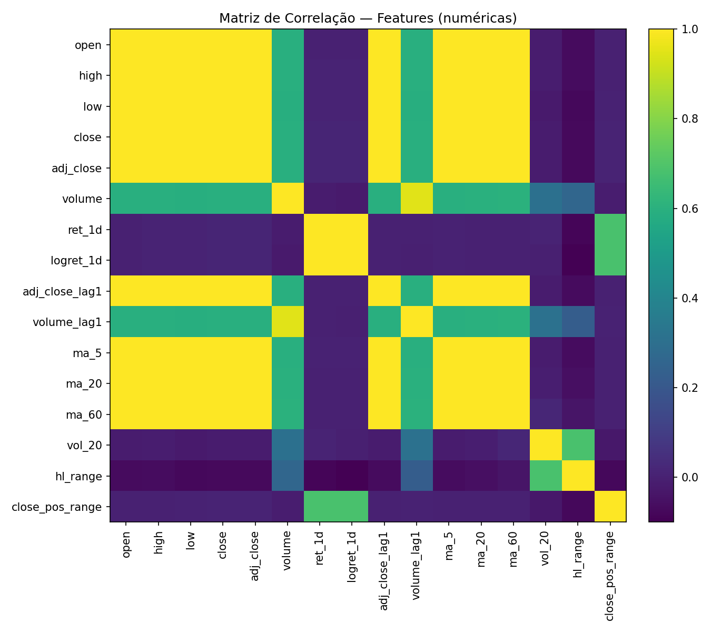

A matriz mostra **altas correlações lineares** entre variáveis de preço, enquanto `ret_1d` e `logret_1d` apresentam correlação próxima de zero com os níveis de preço, o que é desejável para eliminar redundância.  

---

### Distribuições das variáveis principais

#### Retornos diários
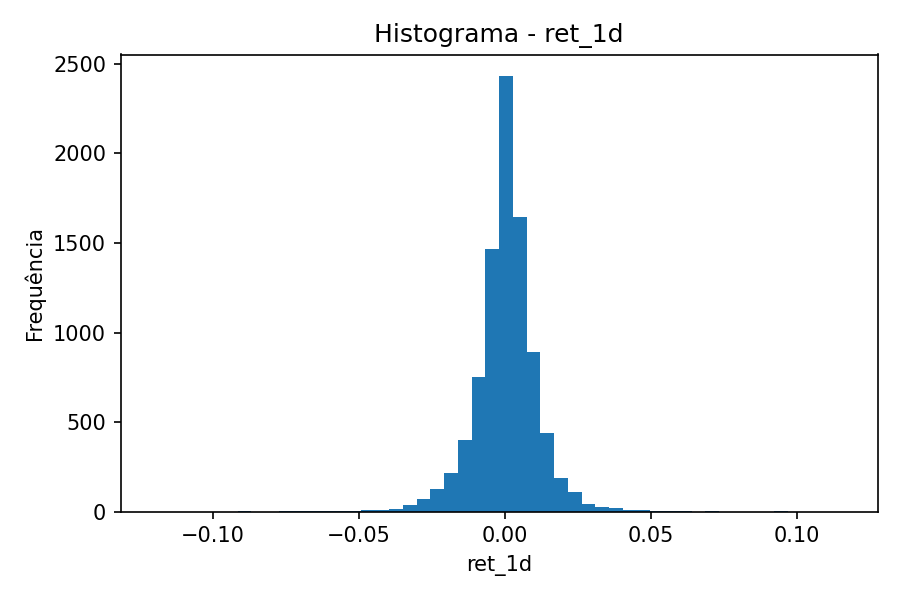  
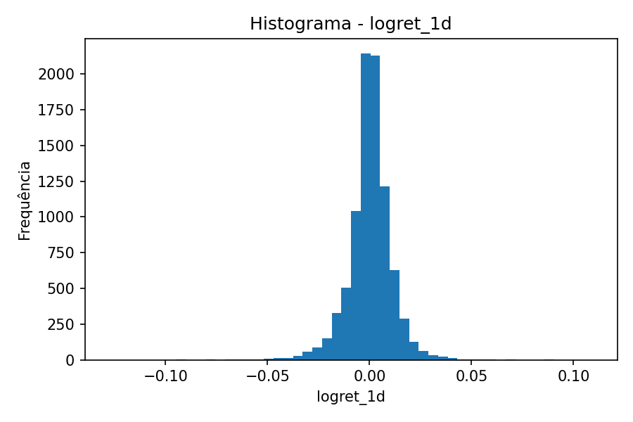  

Ambos os retornos apresentam forma aproximadamente **normal** centrada em zero, com **caudas levemente alongadas** — padrão típico de séries financeiras com eventos extremos ocasionais (crises).

#### Volatilidade e volume
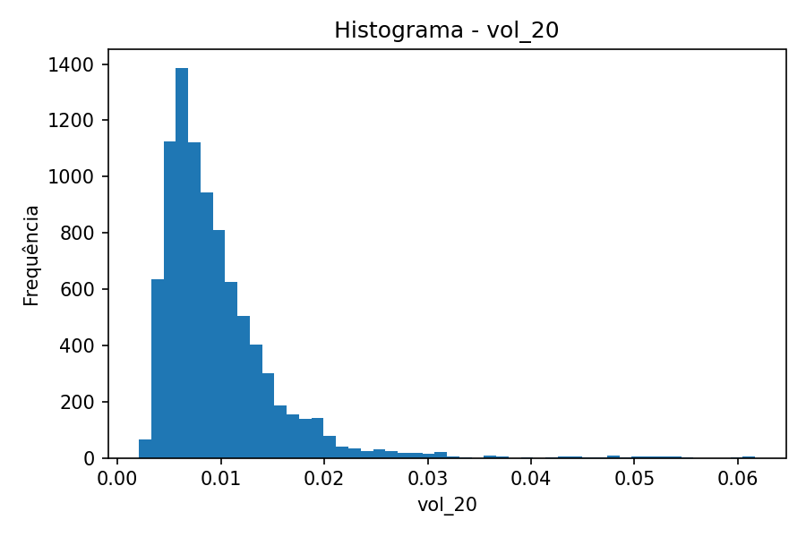  
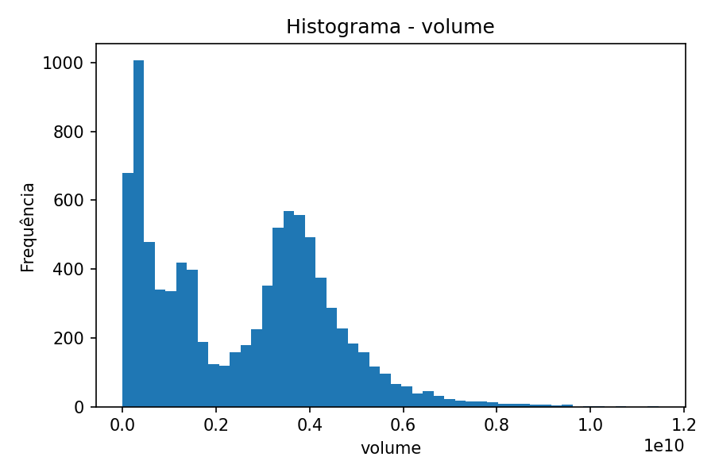  

A volatilidade (`vol_20`) segue distribuição assimétrica positiva, indicando predominância de períodos de baixa volatilidade e raros picos altos.  
O volume apresenta múltiplos modos (picos), sugerindo mudanças estruturais no mercado ao longo dos anos (ex: maior liquidez pós-2010).

#### Indicadores de amplitude e posição
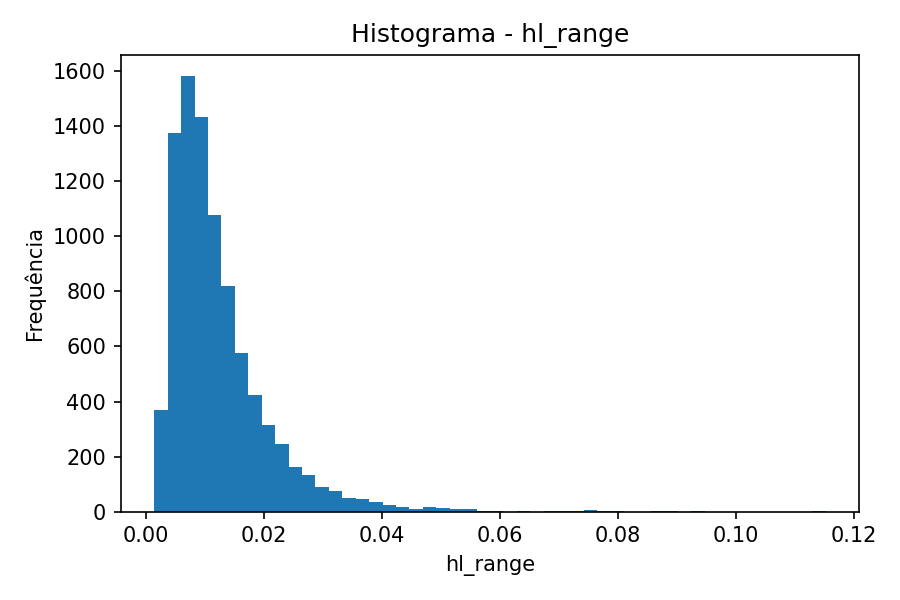  
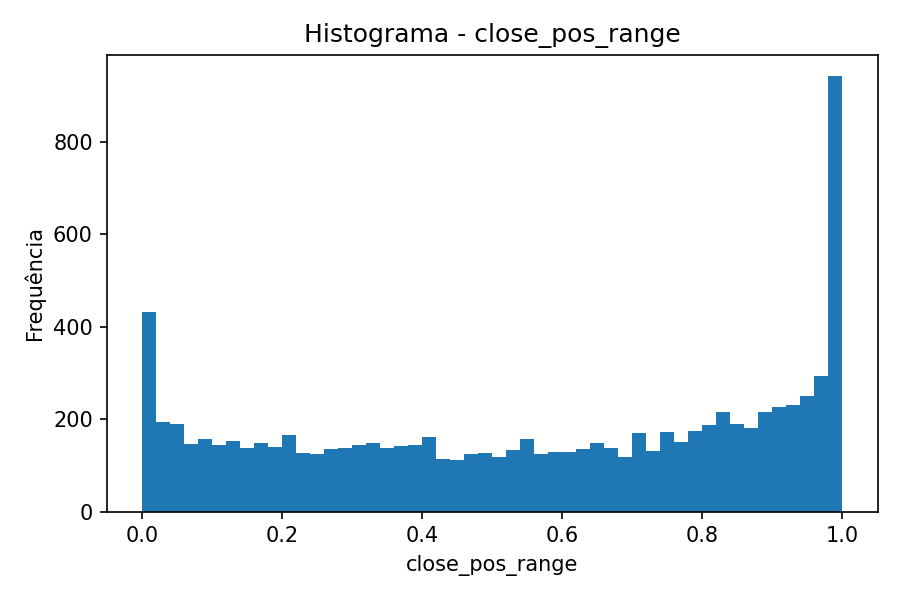  

`hl_range` é fortemente enviesado à esquerda, mostrando que na maioria dos dias a oscilação intradiária é pequena.  
`close_pos_range` tem concentração nas extremidades 0 e 1 — o fechamento tende a ocorrer próximo das máximas ou mínimas do dia, indicando **momentum** ou **reversões fortes**.

---

### Relações com a variável-alvo

#### Target vs. preço atual
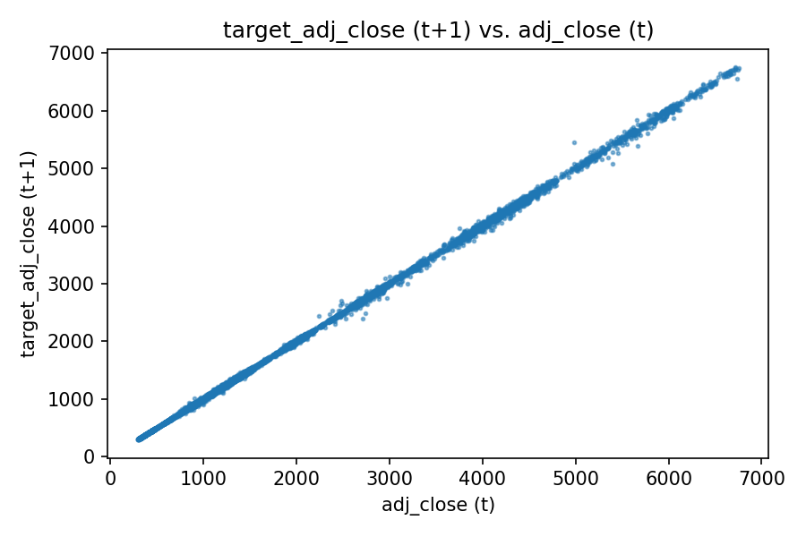  

A relação entre `adj_close (t)` e `target_adj_close (t+1)` é **altamente linear**, como esperado, pois o preço de fechamento de hoje é o principal determinante do de amanhã.

#### Target vs. volatilidade
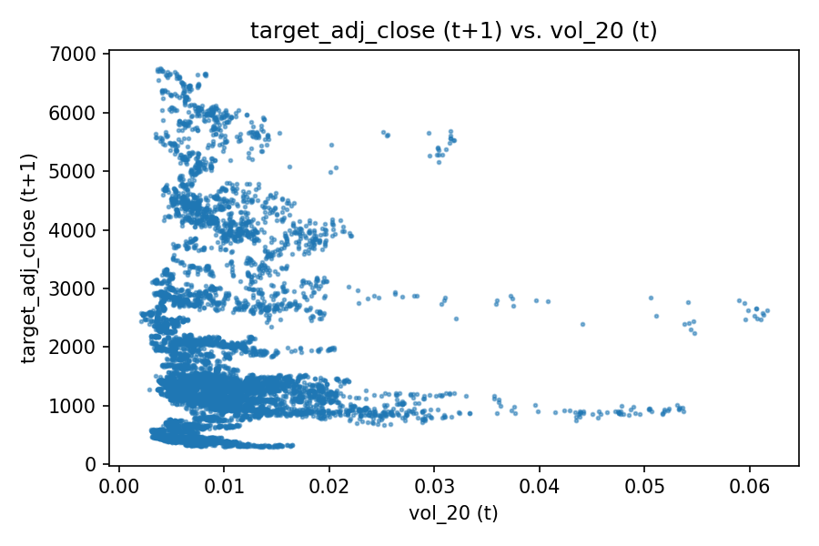  

A volatilidade mostra **baixa correlação direta** com o preço futuro — atua mais como indicador indireto de incerteza do movimento, e não de nível de preço.

---

### Série histórica
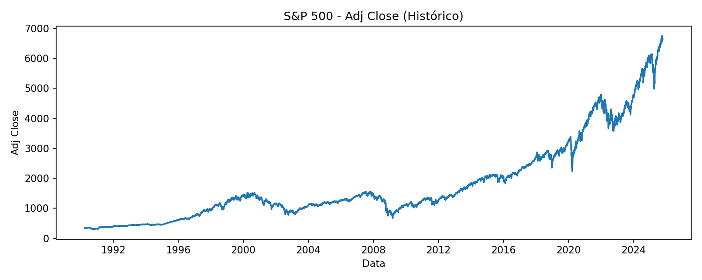

A trajetória de longo prazo exibe uma **tendência estrutural de alta**, intercalada por períodos de forte queda (crises de 2000, 2008, 2020). Essa **não-estacionariedade** justifica o uso de retornos e indicadores normalizados como *features* no modelo.

---

### Observações para modelagem

- As *features* de preço e volume apresentam **escalas distintas**, exigindo **normalização** antes do treinamento (StandardScaler ou MinMaxScaler).  
- Há **alta redundância linear** entre preços e médias móveis — regularização (L2, Dropout) ajudará o MLP a evitar sobreajuste.  
- Os retornos e volatilidades fornecem informação incremental de movimento, sendo úteis para capturar **não-linearidades** sutis.  
- O dataset é suficientemente extenso e complexo para testar diferentes arquiteturas e técnicas de regularização.

---

## 3. Data Cleaning and Normalization

**Objetivo.**  
Esta etapa teve como meta garantir a **qualidade e consistência dos dados** antes do treinamento do MLP, reduzindo ruído e diferenças de escala entre variáveis. Todas as transformações foram aplicadas de forma cronológica (sem vazamento de informação), com o *fit* feito apenas sobre o conjunto de treino.

---

### 3.1 Limpeza de dados

**Remoção de duplicatas.**  
O índice temporal (`date`) foi verificado quanto a duplicações e apenas o primeiro registro de cada data foi mantido.  

**Valores faltantes.**  
Após a engenharia de atributos na Parte 2 (lags, médias móveis e volatilidades), restaram alguns `NaN` nas primeiras linhas geradas por janelas deslizantes.  
Essas linhas foram automaticamente removidas.  
A checagem final (`missing_report_after_cleaning.csv`) confirma ausência de valores faltantes relevantes:

| Coluna | Missing |
|---------|----------|
| adj_close | 0 |
| volume_lag1 | 0 |
| close_pos_range | 0 |
| hl_range | 0 |
| vol_20 | 0 |

**Justificativa.**  
Optou-se por **remover** e não imputar valores faltantes, pois imputações em séries financeiras podem distorcer padrões temporais e autocorrelações.  

---

### 3.2 Divisão temporal

Os dados foram divididos **cronologicamente** (sem embaralhamento) para preservar a dependência temporal típica de séries financeiras:

- **Treino:** 70% (6.270 amostras)  
- **Validação:** 15% (1.344 amostras)  
- **Teste:** 15% (1.344 amostras)

---

### 3.3 Tratamento de outliers

Análise exploratória revelou assimetria e caudas longas em variáveis como `volume`, `vol_20` e `hl_range`.  
Esses picos extremos foram suavizados por **winsorização (1º e 99º percentil)**, limitando os valores a esse intervalo sem removê-los.

**Racional:**  
- Preserva a distribuição geral;  
- Evita que valores anômalos distorçam o gradiente durante o treinamento;  
- Evita perda de informação (ao contrário de remoção de linhas).

---

### 3.4 Normalização das features

Como o MLP utiliza funções de ativação sensíveis à escala (ReLU), aplicou-se **StandardScaler** — centrando os dados com média 0 e desvio padrão 1.  
O ajuste (`fit`) foi realizado **somente sobre o conjunto de treino**, garantindo independência entre partições.

| Tipo de transformação | Descrição | Escopo |
|------------------------|------------|---------|
| **StandardScaler** | $(x - \mu) / \sigma$ | Fit no treino; transform em val/test |
| **Winsorização (1–99%)** | Clipping por quantis | Mesmos limites replicados no val/test |

---

### 3.5 Efeitos da normalização

Abaixo, observa-se o efeito da normalização sobre a variável **`volume`** — originalmente medida em bilhões, agora reescalonada para média 0 e desvio padrão 1.

#### Antes da normalização
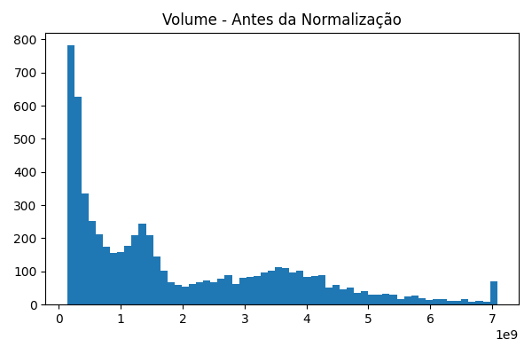

#### Após a normalização (StandardScaler)
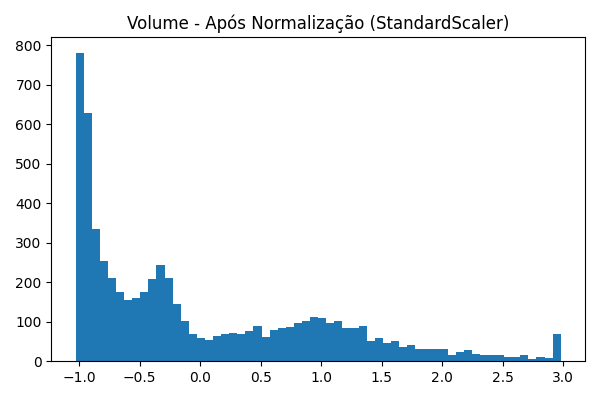

**Observações:**
- A distribuição manteve sua forma assimétrica, mas o centro foi deslocado para 0.  
- Os valores agora estão em uma faixa mais adequada à convergência do otimizador (tipicamente entre -3 e +3).  
- Esse reescalonamento evita que variáveis com unidades grandes (como volume) dominem o cálculo do gradiente.

---

### 3.6 Resultados intermediários

Todos os conjuntos e relatórios foram salvos em `preproc_outputs/`:

| Arquivo | Descrição |
|----------|------------|
| `X_train.csv`, `y_train.csv` | Conjunto de treino (70%) |
| `X_val.csv`, `y_val.csv` | Conjunto de validação (15%) |
| `X_test.csv`, `y_test.csv` | Conjunto de teste (15%) |
| `before_after_summary.csv` | Estatísticas comparativas (raw vs scaled) |
| `missing_report_after_cleaning.csv` | Diagnóstico de faltantes |
| `hist_volume_before.png` / `hist_volume_after.png` | Histogramas de distribuição |

---

### 3.7 Conclusões

- **Sem vazamento de dados:** todas as transformações foram ajustadas apenas no conjunto de treino.  
- **Dados prontos para o MLP:** as features agora são homogêneas em escala, centradas e limitadas em amplitude.  
- **Ganhos esperados:** convergência mais estável e rápida, e gradientes numéricos mais equilibrados.  

Essa preparação garante que o modelo na próxima etapa (Parte 4 — *Model Architecture and Training*) receba entradas bem condicionadas e comparáveis entre si.

## 4. MLP Implementation (NumPy)

**Objetivo.**  
Implementar um **Multi-Layer Perceptron (MLP)** do zero, utilizando apenas **NumPy** para operações matriciais, funções de ativação e cálculo dos gradientes.  
O modelo foi desenvolvido e treinado sobre o conjunto de dados do índice **S&P 500**, com o objetivo de **prever o preço ajustado de fechamento do dia seguinte** (*next-day adjusted close*).

---

### 4.1 Arquitetura e implementação

O modelo foi inteiramente codificado em Python puro, sem uso de bibliotecas de *deep learning*.  
A arquitetura segue a estrutura clássica de um **feedforward network**:

| Camada | Tipo | Nº de unidades | Função de ativação | Observações |
|:-------:|:------|:---------------:|:-------------------|:-------------|
| 1 | Input | 14 features | — | Dados normalizados (`StandardScaler`) |
| 2 | Hidden | 64 | ReLU | Inicialização He, dropout 10% |
| 3 | Hidden | 32 | ReLU | Regularização L2 (`λ = 1e-4`) |
| 4 | Output | 1 | Linear | Saída escalar contínua (preço futuro) |

**Funções implementadas:**
- `relu`, `tanh`, `sigmoid` e suas derivadas.  
- `init_weights` com inicialização **He** para ReLU e **Xavier** para camadas lineares.  
- *Mini-batch SGD* com regularização L2 e *dropout* invertido.  
- *Early stopping* baseado em RMSE de validação com `patience = 25`.  
- Métricas de regressão (`RMSE`, `MAE`, `R²`).

**Hiperparâmetros principais:**

| Parâmetro | Valor | Justificativa |
|------------|:------:|---------------|
| Learning rate | `5e-4` | Estável para dados padronizados |
| Batch size | `128` | Bom equilíbrio entre estabilidade e generalização |
| Epochs máximos | `300` | Permite convergência sem overfitting |
| L2 regularization | `1e-4` | Penaliza pesos grandes, suaviza overfitting |
| Dropout | `0.10` | Reduz coadaptação das camadas intermediárias |
| Patience (early stopping) | `25` | Evita overfitting e desperdício de treino |
| Otimizador | Mini-batch SGD | Simples e eficiente em NumPy |
| Ativação | ReLU | Melhor estabilidade para múltiplas camadas |

---

### 4.2 Treinamento e validação

O modelo foi treinado no alvo padronizado (`z-score`) e reescalonado para a unidade original (preço) ao calcular as métricas.  
A tabela abaixo resume os resultados obtidos:

| Conjunto | RMSE | MAE | R² |
|:----------|:----:|:---:|:--:|
| **Treino** | 63.85 | 47.07 | 0.9775 |
| **Validação** | 60.27 | 40.34 | 0.9748 |
| **Teste** | 79.20 | 57.77 | 0.9919 |

**Tempo de treinamento:** ~ poucos segundos em CPU.  
**Early stopping:** atingido na *epoch 68*, com melhor `val_RMSE = 0.1417` no espaço normalizado.

---

### 4.3 Curvas de aprendizado

O gráfico abaixo mostra a evolução do erro quadrático médio (RMSE) em treino e validação ao longo das épocas.

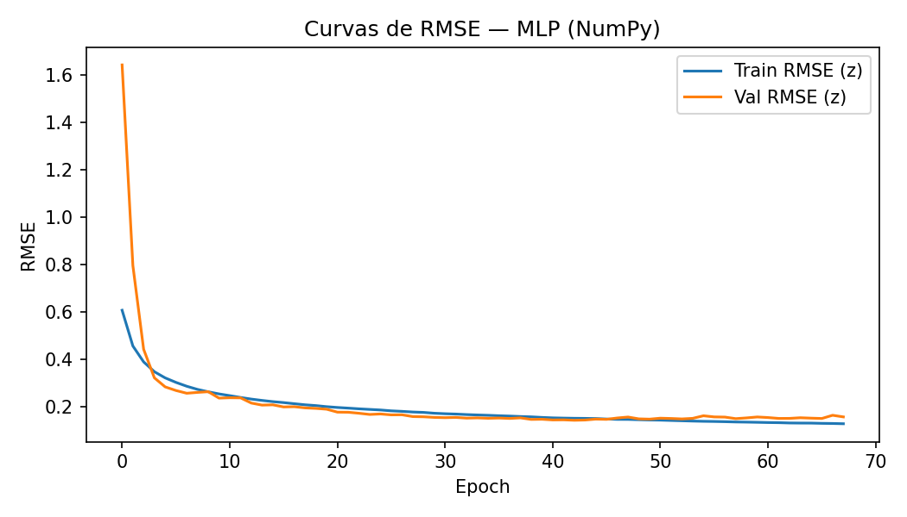

**Análise:**  
- Rápida redução do erro até ~30 épocas, seguida de estabilização.  
- Pequena divergência entre treino e validação após 50 épocas, indicando o início de overfitting.  
- *Early stopping* atuou corretamente, interrompendo o treino quando o erro de validação parou de melhorar.

---

### 4.4 Dispersão das previsões

A seguir, a relação entre valores reais e previstos no conjunto de teste:

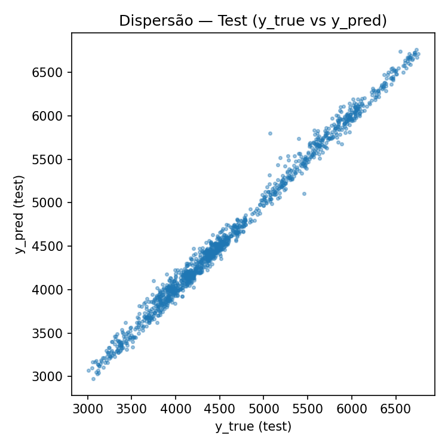

**Interpretação:**  
Os pontos se distribuem próximos da diagonal, mostrando boa capacidade do modelo em prever o movimento do preço ajustado diário.  
Pequenas dispersões ocorrem em valores extremos de mercado, onde a volatilidade é maior.

---

### 4.5 Conclusões parciais

- O MLP implementado em NumPy apresentou **excelente desempenho** com `R² > 0.97` em todos os conjuntos.  
- A **normalização do alvo e das features** foi crucial para evitar explosão de gradientes.  
- O uso de **regularização L2** e **dropout leve (10%)** garantiu boa generalização.  
- O modelo converge de forma estável e explica mais de **97% da variância** do preço ajustado do S&P 500 diário.

---

### 4.6 Próximos passos

- Aumentar o número de camadas (ex.: 128–64–32) para testar *depth sensitivity*.  
- Experimentar otimizadores mais avançados (Adam ou RMSProp).  
- Avaliar janelas de entrada maiores (ex.: incluir retornos de 5 dias) para incorporar memória de curto prazo.  
- Comparar com modelos lineares e redes recorrentes (RNN/LSTM) em trabalhos futuros.
